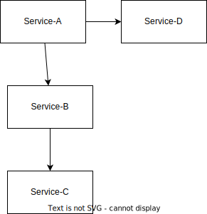

# pms
Project Microservice




# This project is aimed to demonstrate the ability to handle application developed using microservice architecture. 
## Service A –
This is the main calling URL (localhost:8080/api/calculate-svc-a?a=10&b=20)
For the simplicity we are accepting 2 query parameter a and b  and doing simple mathematical calculation on the provided input variable.
This application will to the Addition task and pass the input values to the other apis deployed at other ports.

## Service B – URL (localhost:8081/api/calculate-svc-b?a=10&b=20)
For the simplicity we are accepting 2 query parameter a and b  and doing simple mathematical calculation on the provided input variable.
This application will to the Subtraction task and pass the input values to the other apis deployed at other ports.

## Service C – URL (localhost:8081/api/calculate-svc-c?a=10&b=20)
For the simplicity we are accepting 2 query parameter a and b  and doing simple mathematical calculation on the provided input variable.
This application will to the Multiplication task and return json to the calling api.
## Service D – URL (localhost:8081/api/calculate-svc-d?a=10&b=20)
For the simplicity we are accepting 2 query parameter a and b  and doing simple mathematical calculation on the provided input variable.
This application will to the Division task and return json to the calling api.

### Class InputValue.java
```
Int a,b;
```
### Class OutputValue.java
```
Int a,b,result;
String operation;
```
### Class APIResponse.java
```
ArrayList<OutputValue> calculations;
```


